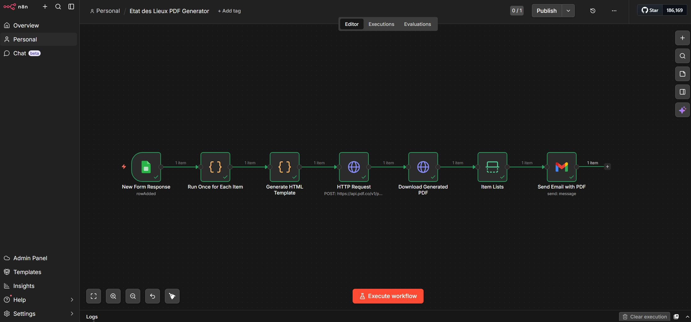
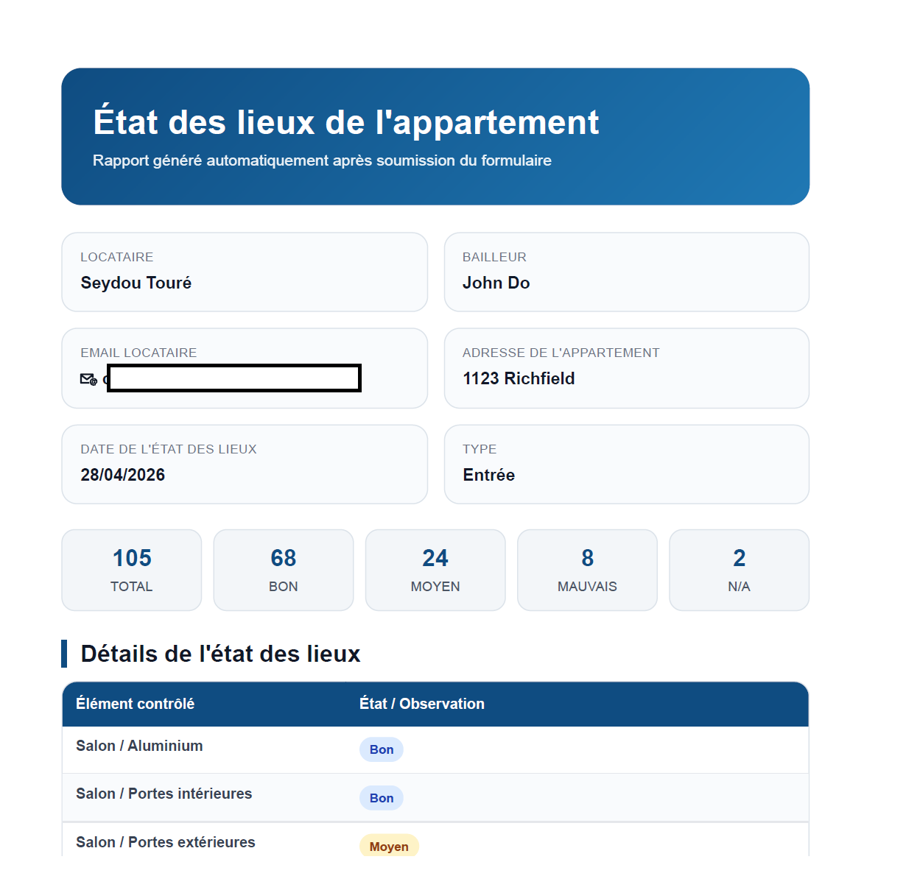
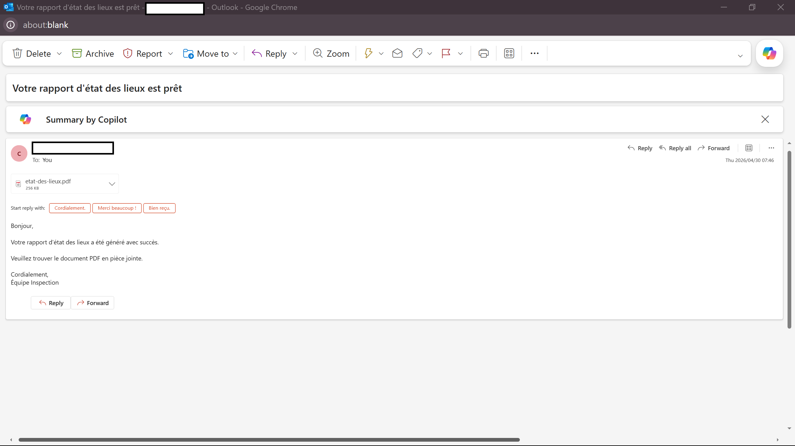

# 🏠 État des Lieux Automation System

⚠️ **Important Notice**

This repository contains multiple automation projects.

👉 The **État des Lieux Automation System** is located here:  
📂 `etat-des-lieux-automation/`

👉 The full documentation is available here:  
📄 `etat-des-lieux-automation/docs/README.md`

---

## 🚀 Project Overview

This system automates the **property inspection process (État des lieux)**:

- 📋 Data collection via forms  
- 📄 Automatic PDF generation  
- 📧 Email delivery to tenant  
- ⚙️ Fully automated workflow using n8n  

---

## 🧠 Features

- Automated report generation  
- Clean PDF layout  
- Email delivery system  
- Scalable workflow automation  

---

## 📸 Screenshots

### 🔹 Workflow Overview


### 🔹 PDF Output Example


### 🔹 Email Delivery


---

## 📂 Project Structure

```bash
etat-des-lieux-automation/
│
├── docs/           # Documentation
├── templates/      # PDF templates
├── workflow/       # n8n workflows
📞 Contact

For implementation or customization:
👉 Available for automation projects and consulting